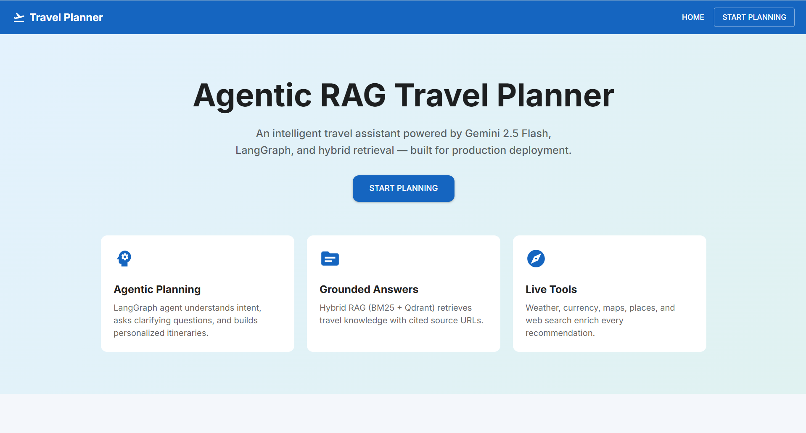

# ✈️ Agentic RAG Travel Planner

A production-grade, agentic travel planning system built on LangGraph, Hybrid RAG (BM25 + Qdrant semantic search), and Gemini 3.5 Flash. The backend runs an 8-step reasoning pipeline — from intent detection to retrieval-grounded itinerary generation — optimized for free-tier deployment on Render and Netlify.

## ✨ Features
- 🧠 Agentic reasoning pipeline — 8 discrete LangGraph nodes with full execution tracing, visible per request
- 🔍 Hybrid retrieval — BM25 keyword search + Qdrant semantic search, merged via Reciprocal Rank Fusion (RRF)
- 🌍 Global city detection — spaCy-based NER, not a hardcoded city list; works for any destination worldwide
- 🛠️ Live tool integration — real-time weather, currency conversion, distance/maps, and web search
- 💬 Multi-turn conversation — context-aware clarification when trip details are incomplete
- 🔁 Resilient LLM calls — automatic retry with backoff and fallback-model routing on transient provider errors
- 📚 Cited responses — every itinerary is grounded in retrieved sources, with citations returned to the client
- 🪶 Memory-safe deployment — no local LLM or embedding model loaded at runtime; embeddings are generated offline only

## 🏗️ Architecture

```
Netlify (React)  →  Render (FastAPI + LangGraph)
                          │
        ┌─────────────────┼─────────────────┐
        ▼                 ▼                 ▼
   Gemini API        Qdrant Cloud      MongoDB Atlas
  (via LiteLLM)     (vector search)   (chat + itinerary logs)
                          │
                 External tool APIs
          (weather · currency  · web search)

```

## Agent Pipeline

```
            👤 User Query
                  │
                  ▼
        🛡️ Safety Check
                  │
                  ▼
       🎯 Intent Analysis
                  │
                  ▼
    ❓ Clarification Decision
                  │
          Enough Information
            │             │
            │             │
            No            └──────────Yes────────────
            │                                       │
            │                                       │
  Ask Clarifying Questions                          ▼
            │                   ─────────────▶🔍 Hybrid Retrieval
    User Provide Details       │                  (BM25 + Qdrant)
            │                  │                      │
            └──────────────────                       ▼
                                              🛠️ Tool Router
                                                      │
                                                      ▼
                                              🤖 Planner Agent
                                                      │
                                                      ▼
                                          ✨ Response Generator
                                                      │
                                                      ▼
                                            📄 Citation Formatter
                                                      │
                                                      ▼
                                            ✅ Final Response

**Memory-safe design:** Embeddings are generated **offline only** with `BAAI/bge-m3`. The deployed backend performs retrieval only — no local LLM, no local embedding model, no PDF processing at startup.

```

## 📁 Project Structure

```
├── backend/           # FastAPI + LangGraph (deployed to Render)
├── frontend/          # React + Vite + MUI (deployed to Netlify)
├── ingestion/         # Offline pipeline (run locally)
├── evaluation/        # RAGAS / DeepEval scripts
└── scripts/           # Utility scripts
```

## 🚀 Quick Start (Local)

### 1. Backend

```bash
cd backend
python -m venv .venv
.venv\Scripts\activate        # Activate virtual environment for your project
pip install -r requirements.txt
copy .env.example .env        # Fill in API keys
```

Build BM25 index from sample data:

```bash
python ../scripts/build_bm25.py
```

Run API:

```bash
uvicorn app.main:app --reload --port 8000
```

Test: `GET http://localhost:8000/health` → `{"status":"ok"}`

### 2. Frontend

```bash
cd frontend
npm install
copy .env.example .env
npm run dev
```

Open http://localhost:5173

### 3. Offline Ingestion (Qdrant + full BM25)

Run **locally only** — never inside the Docker container:

```bash
cd ingestion
python -m venv .venv
.venv\Scripts\activate
pip install -r requirements.txt
python ingest.py --qdrant-url YOUR_URL --qdrant-api-key YOUR_KEY --recreate
```

Add more JSON documents to `ingestion/data/raw/` before running.

## API Specification

### `GET /health`

```json
{"status": "ok"}
```

### `POST /chat`

**Request:**
```json
{
  "messages": [
    {"role": "user", "content": "Plan a 3-day trip to Goa"}
  ]
}
```

**Response:**
```json
{
  "reply": "...",
  "recommendations": [{"title": "...", "type": "hotel", "city": "Goa", "url": "..."}],
  "sources": ["https://..."],
  "end_of_conversation": false,
  "execution_traces": [{"step": "Safety Check", "status": "passed", "detail": "..."}]
}
```

**Agent pipeline:** Safety Check → Intent Analysis → Clarification Decision → Hybrid Retrieval (BM25 + Semantic + RRF) → Tool Router → Planner Agent → Response Generator → Citation Formatter.

## 🔐 Environment Variables

See `backend/.env.example`. Key secrets for HF Spaces:

| Variable | Purpose |
|----------|---------|
| `GEMINI_API_KEY` | Gemini 3.5 Flash via LiteLLM |
| `EMBEDDING_MODEL` | Gemini embedding model (default: text-embedding-004) |
| `EMBEDDING_PROVIDER` | `gemini` (preferred) or `huggingface` |
| `HF_INFERENCE_API_KEY` | Fallback query embeddings for bge-m3 Qdrant vectors |
| `QDRANT_URL` / `QDRANT_API_KEY` | Vector search |
| `MONGODB_URI` | Chat logs / metadata |
| `OPENWEATHER_API_KEY` | Weather tool |
| `EXCHANGERATE_API_KEY` | Currency tool |
| `TAVILY_API_KEY` | Web search |
| `CORS_ORIGINS` | Netlify frontend URL |

## ☁️ Deployment

### Backend — Render

1. Create a **Web Service** on Render and connect this GitHub repository.
2. Set the **Root Directory** to `backend`; Render will automatically build the project using the included `Dockerfile`.
3. Configure all required environment variables in the Render dashboard.
4. Ensure `backend/data/corpus.json` and `backend/data/bm25_index.pkl` are committed to the repository.
5. Deploy the service. Every push to the `main` branch automatically triggers a new deployment.

### Frontend — Netlify

1. Connect repo, set base directory to `frontend`
2. Build command: `npm run build`, publish: `dist`
3. Set `VITE_API_BASE_URL` to your render backend URL

## 🧪 Evaluation

```bash
cd evaluation
pip install -r requirements.txt
python evaluate.py
```

## 🛠️ Tech Stack (Strict)

| Layer | Technology |
|-------|-----------|
| Frontend | React, Vite, MUI, Axios, React Markdown |
| Backend | FastAPI, LangGraph, LiteLLM |
| LLM | Gemini 3.5 Flash (via LiteLLM, with automatic retry + fallback routing) |
| Vector DB | Qdrant Cloud |
| App DB | MongoDB Atlas |
| Entity Extraction | spaCy (`en_core_web_sm`) |
| Retrieval | BM25 + Semantic search, merged via RRF |
| Embeddings | bge-m3 (generated offline during ingestion) |
| Deployment | Netlify (frontend) + Render (backend) |

---

## 🚀 Live Demo

- 🌐 **Frontend Application:** https://agentic-rag-travel-planner.netlify.app
- ⚙️ **Backend API:** https://agentic-rag-travel-planner.onrender.com

> **Note:** The backend is hosted on Render's free tier. The first request after a period of inactivity may take 30–60 seconds while the service wakes up.

---

## 📸 Application Preview



---

## 📄 License

This project is licensed under the [MIT License](LICENSE).

---

## 🤝 Connect with Me

**Aryan Raj**

Data Scientist | AI Engineer | Software Developer

- 🌐 GitHub: https://github.com/aryanraj7791
- 💼 LinkedIn: https://www.linkedin.com/in/aryan-raj-79246b280/
- 📧 Email: aryanraj5371@gmail.com

⭐ If this project helped you, please star the repository!